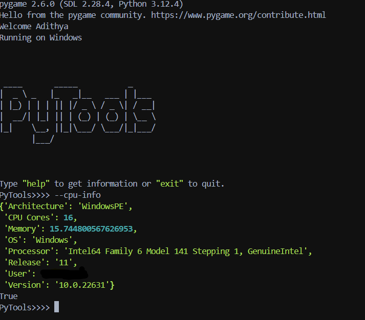

# PyTools

_a simple and lightweight command-line utility tool_

### Key Features:

- **Command History Management**: 
  - View or clear the history of commands executed.

- **HTML Parsing**: 
  - Convert Markdown files to HTML with specified title and command.

- **System Information**: 
  - Retrieve detailed information about CPU and memory usage.

- **Network Information**: 
  - Access vital network-related details.

- **Text Manipulation**: 
  - Change the color of text output in the terminal.

- **File Operations**: 
  - Read, write, safely write, and safely read from files.

## Installation

To install and use PyTools, follow these steps:

1. **Clone the Repository**

   First, clone the repository to your local machine:

   ```bash
   git clone https://github.com/adithya1770/pytools.git


  
